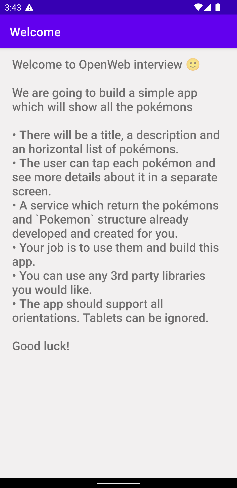
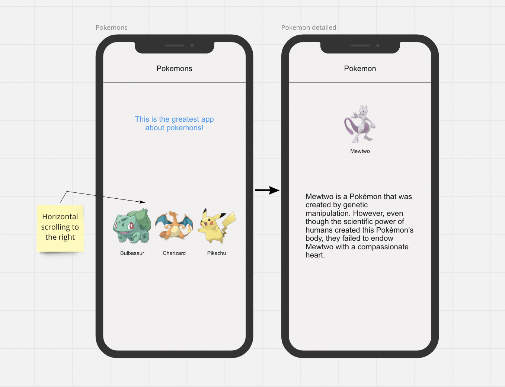

# Welcome to OpenWeb Android interview 🙂 #

We are going to build a simple app which will show all the pokémons

- There will be a title, a description and an horizontal list of pokémons.
- The user can tap each pokémon and see more details about it in a separate screen.
- A service which return the pokémons and `Pokemon` structure already developed and created for you.
- Your job is to use them and build this app.
- You can use any 3rd party libraries you would like.
- The app should support all orientations. Tablets can be ignored.
 

To begin, open the project folder. 
Wait for gradle sync to finish and run the project, that's the screen you supposed to see:
 

  

  
The end result should look something like the following sketchup:
 

  

  
# Good luck! #
